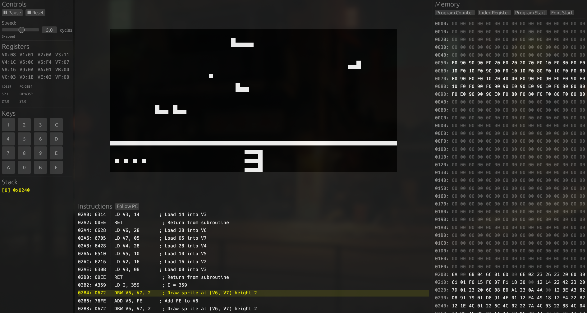

# Chip-8 emulator
This project is an implementation of an emulator for the [CHIP-8](https://en.wikipedia.org/wiki/CHIP-8) [fantasy video game console](https://en.wikipedia.org/wiki/Fantasy_video_game_console).

## How to run
The program can be run by cloning the repo and creating the executable using:
```bash
cargo run --release

```
This will create the executable at ./target/release/chip-8-emulator.
Use `./chip-8-emulator --help` to know more about the arguments that can be provided.


## Screenshot



More roms can be found [here](https://github.com/dmatlack/chip8/tree/master/roms/games)

## Resources
- [CHIP 8 Specification](https://www.cs.columbia.edu/~sedwards/classes/2016/4840-spring/designs/Chip8.pdf)


